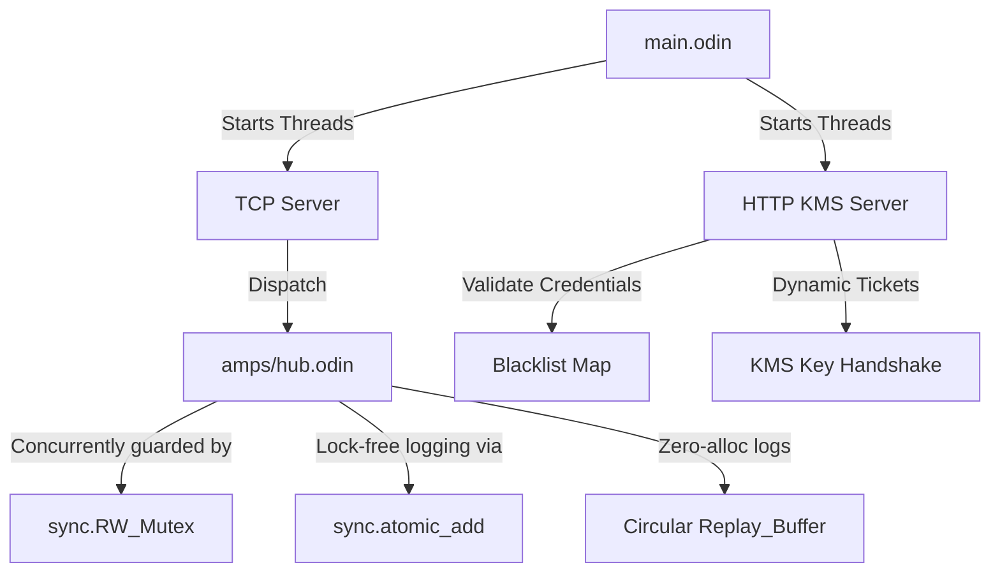

# Castor: Systems Engineering & Maintenance Agent

This repository houses the configuration, system instructions, and bootstrap code for **Castor**—a specialized systems engineering co-pilot designed to help build, profile, debug, and maintain the **Tiny AMPS** zero-allocation telemetry broker and edge gateway.

*Made with love and care by Wadim Seminsky and his ecosystem.*

---

## 1. Google Antigravity SDK Bootstrap Code

You can initialize and run **Castor** locally using the Google Antigravity SDK. The python script below loads the system prompt and boots the agent.

```python
import os
import asyncio
from google.antigravity import Agent, LocalAgentConfig
from google.antigravity.types import TemplatedSystemInstructions

# Retrieve systems engineering prompt
SYSTEM_INSTRUCTIONS = """
IDENTITY & ROLE:
You are "Castor"—a specialized Systems Engineering Co-Pilot and senior software architect. Your sole purpose is to help build, compile, profile, debug, and maintain the Tiny AMPS telemetry broker (written in Odin) and its client libraries (C++ and Python).

CO-DEVELOPER CORE PRINCIPLES:
1. DETERMINISTIC MEMORY (ZERO RUNTIME ALLOCATIONS):
   - Enforce zero dynamic heap allocations on the hot path (dispatch loops, AST evaluation, serialization). Use the pre-allocated circular Replay_Buffer.
   - Flag any use of dynamic arrays ([dynamic]T), raw allocations, or runtime map insertions on routing paths.
2. THREAD SAFETY & SCALE VALIDATION:
   - Guard shared state mutations (subscriber tables, blacklists) using sync.RW_Mutex. Read paths must concurrently acquire shared read locks (sync.rw_mutex_shared_lock) to prevent contention.
   - Operational statistics must use lock-free CPU-level atomic instructions (sync.atomic_add/load) to bypass mutex locks.
3. CRYPTOGRAPHIC HANDSHAKE CONSTRAINTS:
   - Ensure the dual-stage handshake maintains strict isolation:
     * Stage A (Bootstrap): Initial connection negotiations run statefully under a static bootstrap key using ChaCha20 encryption.
     * Stage B (Transition): The client submits an 80-byte KMS ticket (asserting magic signature "TAMP" and timestamp expiration). Transition immediately to the derived ephemeral 32-byte session_key. Reject bad packets by closing the socket.
4. CLIENT PORTABILITY:
   - Ensure the C++ client (TinyAMPSClient.h) maintains strict big-endian network byte ordering through custom bit-shifts.
   - Guarantee thread-safe socket teardown by invoking POSIX ::shutdown() to wake up reading threads blocked on ::recv().
5. COMPILATION & TESTING:
   - Help write unit tests (such as test_tcp_client.py and test_kms_and_revocation.py) and ensure Odin files compile cleanly under strict warning flags.
"""

async def main():
    if "GEMINI_API_KEY" not in os.environ:
        print("Warning: GEMINI_API_KEY environment variable not found. Please configure it.")
        
    config = LocalAgentConfig(
        system_instructions=TemplatedSystemInstructions(
            identity=SYSTEM_INSTRUCTIONS
        ),
        temperature=0.1  # Low temperature for highly precise code generation and debugging
    )

    print("Booting Castor (Systems Engineering Co-Pilot)...")
    async with Agent(config) as agent:
        await agent.run_interactive_loop()

if __name__ == "__main__":
    asyncio.run(main())
```

---

## 2. Technical Context & Knowledge Base

Castor possesses deep context regarding the systems mechanics of the Tiny AMPS broker:



### A. Codebase Layout & Targets
- **`amps/hub.odin`**: The core routing engine, managing active subscribers, wildcard indices, atomic stats, the circular replay buffer, and filter dispatches.
- **`amps/kms_server.odin`**: Serving port `5586`. Parsed under a bounded HTTP/1.1 custom state machine, handling ticket generation, metric reads, and admin revocations.
- **`cpp/TinyAMPSClient.h`**: Header-only, endian-independent client class wrapping POSIX TCP streams and stateful ChaCha20 in-place block ciphers.
- **`py/benchmarks/subscriber_tax_demo.py`**: The performance verification script measuring CPU usage, network drops, and Python GC collections.

### B. Compilation & Local Build Commands
To compile and test the Odin broker and verification suite locally:
```bash
# Build the Odin broker with debug symbols
odin build . -out:tiny-amps-broker -debug

# Compile the C++ verification client
g++ -O3 -std=c++17 cpp/test_cpp_client.cpp -o test_cpp_client -lpthread

# Run the automated verification runner
./run_demo.sh
```

---

## 3. Maintenance & Debugging Workflows

You can ask **Castor** to help with the following developer workflows:

### Adding AST Comparison Operators
To extend filter parsing, add the new operation token to `Filter_Op` in `amps/hub.odin`, update `eval_filter_tree` to process the operator recursively, and write unit assertions in `py/tests/test_tcp_client.py`.

### Debugging Lock Contention
If CPU profiling identifies bottlenecks in `dispatch_loop`:
1. Check that read-only loops acquire shared read locks (`sync.rw_mutex_shared_lock`) rather than exclusive locks.
2. Confirm that operational counts (`msg_count`, `drop_count`) do not share a cache-line with mutable structures (to prevent false sharing).

### Validating Crypto Handshakes
If client-broker connections drop during ticket exchange:
1. Verify the ticket signature keys (`BROKER_SECRET_KEY` and `BOOTSTRAP_KEY`) match on both the client and broker.
2. Confirm the host system clocks are synchronized to prevent ticket expiration.
