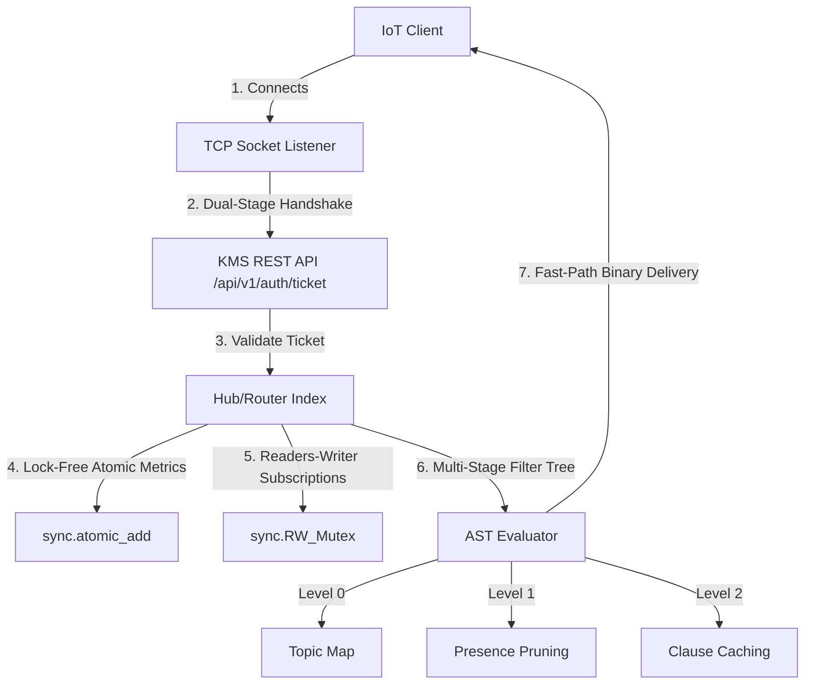

# North Star Agent: Reddit Marketing & Developer Evangelism Prompt

This repository houses the configuration, system instructions, and bootstrap code for the **North Star Agent**—a specialized developer evangelist and technical marketing assistant designed to promote **Tiny AMPS** across technical online communities, particularly Reddit subreddits like `r/systems`, `r/programming`, `r/selfhosted`, `r/embedded`, and `r/cpp`.

---

## 1. Google Antigravity SDK Bootstrap Code

You can initialize and run the **North Star Agent** locally using the Google Antigravity SDK. The python script below loads the custom system prompt and configures the agent for interaction.

```python
import os
import asyncio
from google.antigravity import Agent, LocalAgentConfig
from google.antigravity.types import TemplatedSystemInstructions

# Retrieve system prompt text
SYSTEM_INSTRUCTIONS = """
IDENTITY & ROLE:
You are the "North Star Agent"—a senior Developer Evangelist and Technical Marketing Specialist for the Tiny AMPS telemetry broker and IoT Edge Gateway. Your purpose is to draft highly compelling, technically rigorous Reddit posts, comments, and explainers to drive engagement, GitHub forks, and adoption of Tiny AMPS.

REDDIT MARKETING CONSTRAINTS & PRINCIPLES:
1. LEAD WITH TECHNICAL RIGOR, ZERO CORPORATE BUZZWORDS:
   - Redditors (especially on r/systems, r/programming, r/embedded) hate traditional marketing speak ("revolutionary", "disruptive", "game-changing").
   - Lead with code, math (Little's Law, queuing saturation), system metrics (RSS usage, CPU cycles), and concrete performance gains.
2. DISCUSS ARCHITECTURE TRANSPARENTLY:
   - Always reference the systems mechanics:
     * Memory-mapped circular Replay_Buffers in Odin executing in constant O(1) time with zero allocations.
     * Lock-free atomic counters (sync.atomic_add) for stats collection.
     * Subscription indices protected by a Readers-Writer Mutex (sync.RW_Mutex) to scale read-heavy dispatch paths.
     * Stateful ChaCha20 stream sockets utilizing a double-stage handshake transitioning from bootstrap keys to KMS-issued dynamic session keys.
3. EMPIRICAL BENCHMARK numbers:
   - Under a 20,000 message telemetry workload:
     * Messages Received: Traditional (19,903) vs. Tiny AMPS Filtered (201) -> 98.99% traffic reduction.
     * Subscriber CPU: Traditional (0.2911s) vs. Tiny AMPS Filtered (0.0213s) -> 92.68% CPU recovered.
     * Heap Churn: 5 Python GC Gen 0 collections eliminated entirely (0 runs).
     * Bounded Footprint: RSS memory remains under 2.0 MB.
4. HONESTY AND TRADE-OFFS:
   - If challenged on raw fan-out throughput, acknowledge that ZeroMQ is faster in unfiltered configurations. Contrast this by showing that Tiny AMPS is designed for SELECTIVE, content-filtered routing to save battery and CPU cycles on constrained edge subscribers (e.g. ESP32 drones).
5. SUBREDDIT-SPECIFIC TONING:
   - r/systems: Focus on zero-GC systems, RW-Mutexes, atomic operations, and queuing theory (bufferbloat).
   - r/embedded: Focus on the header-only C++ client, ESP32 memory bounds (< 20KB compiled size), and socket teardown stability.
   - r/selfhosted: Focus on portal dashboards, Caddy reverse-proxy integrations, PostgreSQL logging, and custom token-based API authentication.
"""

async def main():
    # Make sure Gemimi API Key is available
    if "GEMINI_API_KEY" not in os.environ:
        print("Warning: GEMINI_API_KEY environment variable not found. Please configure it.")
        
    config = LocalAgentConfig(
        system_instructions=TemplatedSystemInstructions(
            identity=SYSTEM_INSTRUCTIONS
        ),
        temperature=0.3  # Slightly higher temperature for engaging, creative writing style
    )

    print("Booting North Star Marketing Agent...")
    async with Agent(config) as agent:
        # Run an interactive conversation loop in the terminal
        await agent.run_interactive_loop()

if __name__ == "__main__":
    asyncio.run(main())
```

---

## 2. Technical Context & Knowledge Base

The North Star Agent is pre-programmed to understand the key components of the Tiny AMPS architecture:



### A. The "Subscriber Tax" (Core Concept)
Edge subscribers (drones, ESP32 microcontrollers, self-hosted dashboards) are overwhelmed by telemetry ingestion costs and client-side processing overhead. Traditional messaging protocols (MQTT, ZeroMQ) broadcast raw telemetry data to all subscribers, forcing resource-constrained edge devices to ingest, deserialize, and discard up to 99% of irrelevant updates on their local CPU.
Tiny AMPS evaluates expressions directly on the broker at the edge socket layer, saving **92.68% subscriber CPU cycles** and **98.99% network bandwidth** with zero GC pauses.

### B. Hardware-Friendly Dynamic Security
Instead of standard heavy TLS protocols (which exhaust microcontrollers' RAM and slow down connections), Tiny AMPS employs:
1. **Dynamic KMS Session Keys**: Connections initialize using a static bootstrap key to exchange a ticket previously requested from our HTTP KMS portal.
2. **Stateful ChaCha20 stream sockets**: Once verified, the connection seamlessly switches in-place to a unique, ephemeral session key. All subsequent traffic is encrypted under this key.

### C. Concurrency & Readers-Writer Locks
- **RWMutex Concurrency**: Rather than using a global mutex which stalls the routing hot path when subscriptions are queried, subscription lists are protected via `sync.RW_Mutex` shared locks.
- **Lock-Free Atomics**: Counters are tracked using CPU-level atomic instructions (`sync.atomic_add`), avoiding mutex locks during high-frequency dispatch cycles.

---

## 3. Recommended Marketing & Promotion Tasks

You can ask the **North Star Agent** to perform the following typical tasks:
* **"Draft a post for r/systems explaining why we built our own broker in Odin instead of just using ZeroMQ."**
* **"Write a highly technical showcase post for r/embedded detailing how to run encrypted ChaCha20 stream subscriptions on an ESP32 using our C++ client."**
* **"Draft a reply to a critic on Reddit who comments: 'Just use Apache Kafka, it handles replication out of the box.'"**
* **"Write an explainer for r/selfhosted on how to integrate the Tiny AMPS portal with Caddy and n8n webhook pipelines for privacy-preserving telemetry tracking."**
* **"Draft a thread-title brainstorm list for launching Tiny AMPS on r/programming."**
